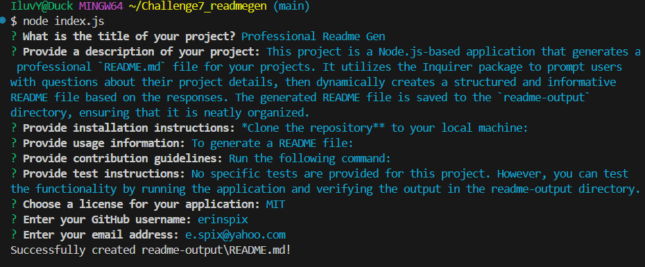

# Professional Readme Gen

## Description

This project is a Node.js-based application that generates a professional `README.md` file for your projects. It utilizes the Inquirer package to prompt users with questions about their project details, then dynamically creates a structured and informative README file based on the responses. The generated README file is saved to the `readme-output` directory, ensuring that it is neatly organized.

## Table of Contents

- [Description](#description)
- [Installation](#installation)
- [Usage](#usage)
- [License](#license)
- [Contributing](#contributing)
- [Tests](#tests)
- [Questions](#questions)

## Installation

*Clone the repository** to your local machine:
https://github.com/erinspix/Challenge7_readmegen.git
Install Dependancies:
npm install
## Usage

To generate a README file:
Open your terminal and navigate to the project's root directory.
Run the following command:
node index.js
Answer the prompts to provide information about your project.
Once complete, a README.md file will be generated in the readme-output folder.

## License

This project is licensed under the MIT license.
For more details, see: [MIT](https://opensource.org/licenses/MIT)

## Contributing

 feel free to fork the project and make it your own
## Tests

No specific tests are provided for this project. However, you can test the functionality by running the application and verifying the output in the readme-output directory.

## Questions

For any questions, please contact me with the information below:

GitHub: [erinspix](https://github.com/erinspix)  
Email: e.spix@yahoo.com

- **terminal**: 

Demo:
[Watch demo video](./images/SVG%20Logo%20With%20Sound.mp4)